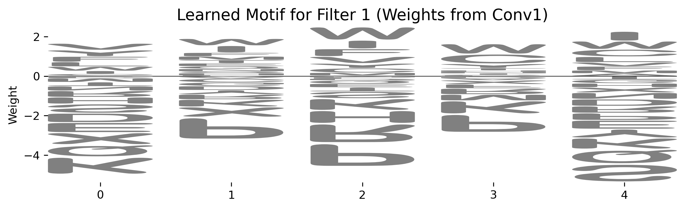

# Deep Learning for Phosphorylation Site Prediction: Identifying Modified Residues

## Project Overview
This repository presents a deep learning project focused on predicting experimentally validated **phosphorylation sites** in human proteins. It demonstrates the application of Convolutional Neural Networks (CNNs) to protein sequence data, showcasing skills in proteomic data acquisition, rigorous preprocessing, deep learning model development, comprehensive evaluation, and model interpretation within a biological context.

## Goals of this Project
The primary goals of this project were to:
* Build a deep learning model to accurately predict whether a given Serine (S), Threonine (T), or Tyrosine (Y) residue within a protein sequence is a phosphorylation site (binary classification).
* Gain hands-on experience with the entire deep learning pipeline in bioinformatics, from raw protein data to model interpretation.
* Demonstrate proficiency in PyTorch for neural network development on biological sequence data.
* Showcase skills in large-scale proteomic data handling, feature engineering (amino acid encoding), and interpreting learned sequence motifs.

## Key Findings

* **Robust Classification Performance:** The trained CNN achieved a strong performance on unseen protein sequences, demonstrating its ability to distinguish between phosphorylated and non-phosphorylated sites.
    * **Accuracy (0.6727):** The model correctly classified approximately 67.27% of phosphorylation sites.
    * **Precision (0.6725):** When the model predicted a site as phosphorylated, it was correct approximately 67.25% of the time.
    * **Recall (0.6741):** The model successfully identified about 67.41% of all actual phosphorylation sites in the test set.
    * **F1-Score (0.6733):** This balanced metric reflects a good overall performance in identifying phosphorylation sites.
    * **ROC AUC (0.7420):** The Receiver Operating Characteristic Area Under the Curve (ROC AUC) score of 0.7420 indicates a solid discriminative power, showing the model's strong ability to rank positive instances higher than negative ones.

* **Learned Amino Acid Motifs:** Analysis of the first convolutional layer's filters revealed learned amino acid sequence patterns (motifs). These learned motifs offer insights into the sequence context preferred by the phosphorylation events, often showing preferences for Serine, Threonine, or Tyrosine at the center and specific amino acids at flanking positions, consistent with known kinase recognition motifs.

## Computational Environment Setup
* **Operating System:** macOS (Apple M4 chip, 16GB RAM).
* **Conda:** Utilized Miniconda for environment management.
    * Channels configured: `conda-forge`, `bioconda`, `defaults` (with strict priority).
    * **`bioinfo_general` environment:** Python 3.9, `pytorch` (with MPS support), `numpy`, `scikit-learn`, `matplotlib`, `pandas`, `logomaker`.
* **PyTorch:** Primary deep learning framework, leveraging Apple's Metal Performance Shaders (MPS) for GPU acceleration on the M4 chip.
* **Development Environment:** VS Code for script development and integrated terminal execution.

### **Key Troubleshooting Overcome**
This project involved navigating several significant computational and data challenges:
* **Data Consistency (EPSD vs. UniProt):** Addressed significant discrepancies where phosphorylation sites from EPSD were outside the bounds of the corresponding full protein sequences from UniProt. This required implementing robust checks and filtering invalid samples during data preprocessing.
* **Git GitHub Large File Limits:** Overcame GitHub's 100MB file size limit by meticulously configuring `.gitignore` to exclude the very large raw data files (`Homo_sapiens.txt`, `uniprot_mapping.fasta`), while ensuring smaller processed/intermediate data files were still tracked. This involved careful use of `git rm --cached`, `git reset`, and resolving persistent push errors due to unpushed large objects in Git history by undertaking a clean repository rebuild.
* **PyTorch Model Setup:**
    * Ensured proper calculation of the flattened layer size for the CNN by accurately accounting for `padding='same'` and pooling effects.
* **Training Loop Logic:** Rectified errors in the validation loop where loss calculation and model saving were performed per batch instead of per epoch.
* **Model Evaluation:** Corrected the test set evaluation to ensure the best-saved model was used for inference and all prediction lists were correctly extended.

## Data Acquisition
* **Experimentally Validated Phosphorylation Sites (Positive Examples):** Acquired `Homo_sapiens.txt` from the EPSD (Eukaryotic Protein Phosphorylation Sites Database), containing human experimentally validated phosphorylation sites.
* **Full Protein Sequences:** Acquired `uniprot_mapping.fasta` from UniProt, containing the full protein sequences corresponding to the UniProt IDs found in the EPSD data.
* **Negative Sequence Generation:** Non-phosphorylated Serine (S), Threonine (T), and Tyrosine (Y) residues were extracted from the full UniProt protein sequences, ensuring they were not listed as experimentally validated phosphorylation sites in the EPSD data. The dataset was balanced to contain an equal number of positive and negative samples.

## Analysis Workflow
The analysis was performed using Python within a dedicated Conda environment, leveraging PyTorch for deep learning. The workflow is encapsulated in modular scripts:

1.  **Data Preprocessing (`scripts/data_preprocessing.py`):**
    * Parses raw FASTA protein sequences and tab-separated phosphorylation site data.
    * Extracts fixed-length (21-mer) amino acid sequence windows centered around both experimentally validated phosphorylation sites (positive samples) and non-phosphorylated S/T/Y residues (negative samples), handling sequence boundaries with 'X' padding.
    * Implements one-hot encoding to convert amino acid sequences into numerical representations.
    * Balances the dataset (1:1 ratio of positive to negative samples) and splits it into training (65%), validation (15%), and test (20%) sets.
    * Defines a custom `PhosphoDataset` class and `DataLoader` instances for efficient batching and loading of data during training.
    * Saves the processed `train_data`, `val_data`, and `test_data` as `.pkl` files to `data/processed/` to enable quick loading for subsequent training runs. The script includes a `get_dataloaders` function to manage this process.

2.  **Deep Learning Model Building (`models/cnn_predictor.py`):**
    * Defines the `PhosphoPredictorCNN` architecture. This 1D CNN is composed of three convolutional blocks (each with `nn.Conv1d`, `nn.ReLU` activation, `nn.MaxPool1d`, and `nn.Dropout` for regularization).
    * Convolutional layers use `padding='same'` and progressively increase `out_channels` (64, 128, 256) to capture hierarchical features.
    * The CNN output is flattened and fed into fully connected layers (`nn.Linear` with `nn.ReLU` and `nn.Dropout`), culminating in a single output neuron for binary classification.

3.  **Model Training & Evaluation (`scripts/train_model.py`):**
    * Loads the preprocessed data via `get_dataloaders`.
    * Instantiates the `PhosphoPredictorCNN` model, moving it to the Apple Silicon MPS (GPU) device if available.
    * Uses `torch.nn.BCEWithLogitsLoss` as the loss function (for numerical stability with raw logits) and `torch.optim.Adam` as the optimizer (with a learning rate of 0.0005).
    * Implements a training loop for 30 epochs, monitoring performance on the validation set after each epoch.
    * Saves the model's state dictionary to `models/best_phospho_predictor.pth` if validation loss improves.
    * Evaluates the best-performing model on the held-out test set, calculating key classification metrics: Accuracy, Precision, Recall, F1-Score, and ROC AUC.

4.  **Model Interpretation (`scripts/interpret_model.py`):**
    * Loads the trained `best_phospho_predictor.pth` model.
    * Extracts the weight matrices from the first convolutional layer (`model.conv1.weight.data`).
    * Uses the `logomaker` library to visualize these weight matrices as sequence motif logos. Each logo visually represents a pattern that a specific filter learned to recognize in the amino acid sequences.
    * Motif visualizations are saved as `.png` files to the `results/motifs/` directory.

## Results

Below are the final performance metrics achieved by the `PhosphoPredictorCNN` on the unseen test set, demonstrating its predictive capabilities for phosphorylation sites.

* **Test Set Performance:**
    * **Accuracy:** 0.6727
    * **Precision:** 0.6725
    * **Recall:** 0.6741
    * **F1-Score:** 0.6733
    * **ROC AUC:** 0.7420

* **Learned Motif Examples:**

    Example Motif 1 (if you save `filter_1_motif.png`):
    

    Example Motif 2 (if you save `filter_2_motif.png`):
    

## Contact
Atharva Bandekar
[LinkedIn](https://www.linkedin.com/in/atharva-bandekar/)  

## Declarations
As I am new to computational biology, I have used AI (Google Gemini) in an minimal capacity to provide conceptual guidance and aid with script snippets. Additionally, I also used AI (Google Gemini), to help strcuture the generate markdown code for this README.md file.

All code execution, problem-solving, and learning was performed by myself, Atharva Bandekar.
